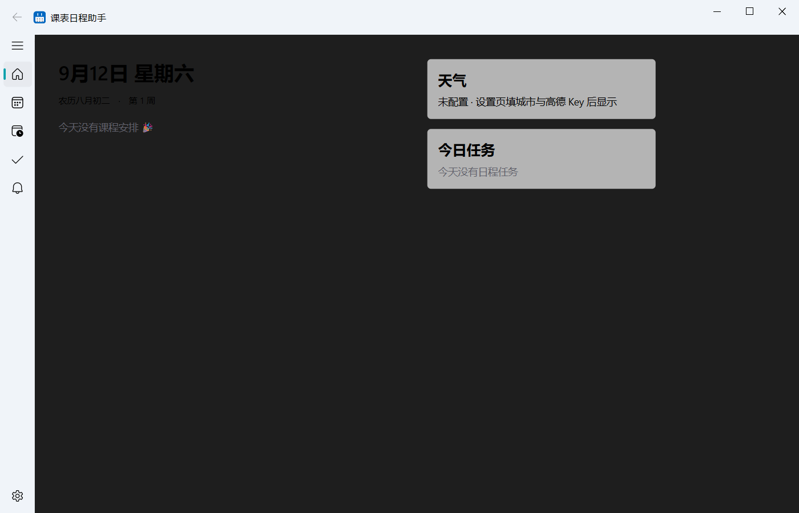
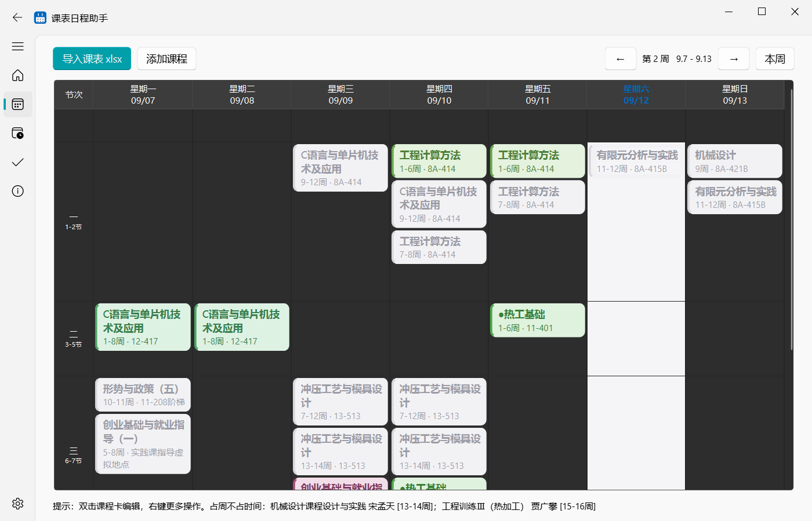
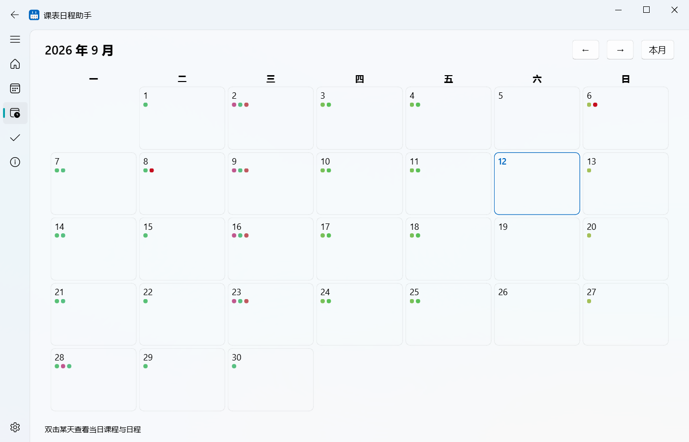
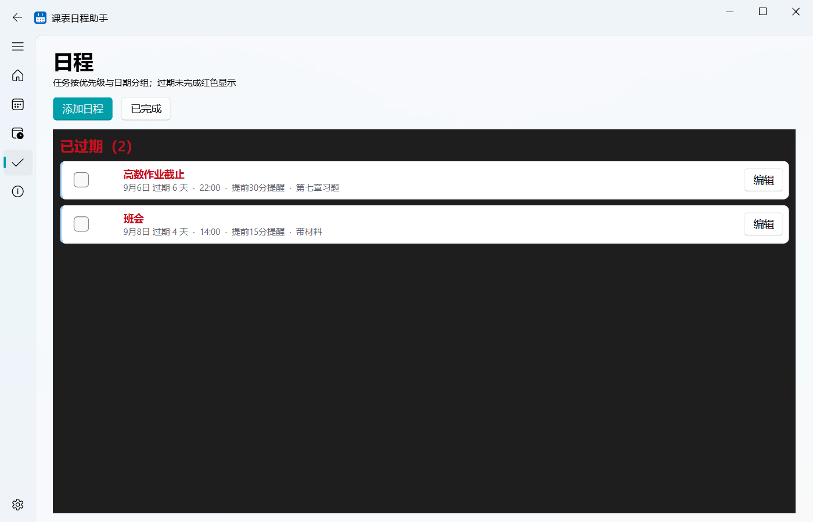
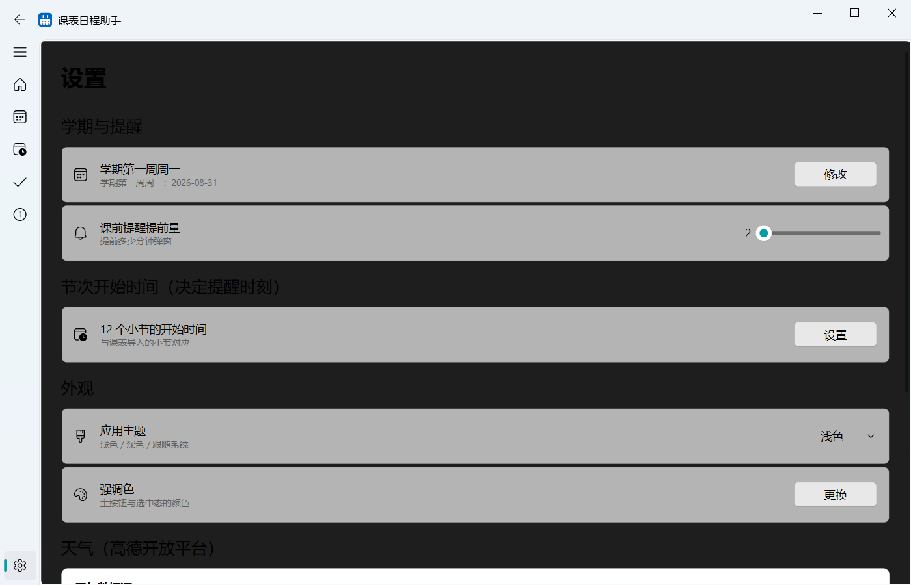

# 课表日程助手 Schedule Desk

Windows 桌面课表/日程/提醒工具，WinUI 3 (Fluent Design) 风格，基于 [PySide6-Fluent-Widgets](https://github.com/zhiyiYo/PyQt-Fluent-Widgets) 构建。



## 功能

- **今日**：启动落地页——当日课程时间线（已结束 / 进行中 / 未开始三态高亮）、今日任务勾选、天气实况与 3 日预报、农历 / 传统节日 / 学期周次
- **课表**：Excel 课表一键导入（支持 `9-12;13-14` 周次段与一格多课）、周视图切换、非本周课程灰显、双击 / 右键编辑课程
- **月历**：整月视图，课程色点与日程红点一目了然，双击查看当日安排
- **日程**：按已过期 / 今天 / 未来 / 已完成分组，优先级（低中高）左条色标识，过期未完成红色提醒
- **提醒中心**：每次课前 / 日程提醒自动留痕，未读标识，一键全部已读
- **设置**：学期第一周、课前提醒提前量、12 节开始时间、亮 / 暗 / 跟随系统主题、8 色强调色、高德天气（实况 + 预报）、开机自启

## 截图

| 课表 | 月历 |
|---|---|
|  |  |

| 日程 | 设置 |
|---|---|
|  |  |

## 运行

```bash
# Python 3.10+
pip install PySide6 "PySide6-Fluent-Widgets[full]" openpyxl keyboard
python app/app.py
```

首次启动：课表页「导入课表 xlsx」→ 设置页确认「学期第一周周一」日期，课前提醒即生效。

### 打包为 exe

```bash
pyinstaller -y --noconsole --onedir --name 课表日程助手 --paths . app/app.py
```

## 数据说明

- 全部数据存本地 SQLite 单文件（`data/app.db`），导入覆盖前自动备份
- 天气数据来自高德开放平台（免费 Key，可选配置；不配置仅隐藏天气卡片）
- 不上传任何数据，无账号体系

## 许可证

- 本项目以 [GPL-3.0](LICENSE) 协议开源
- UI 基于 [PyQt-Fluent-Widgets](https://github.com/zhiyiYo/PyQt-Fluent-Widgets)（免费版，GPL-3.0）构建，感谢作者 [@zhiyiYo](https://github.com/zhiyiYo)
